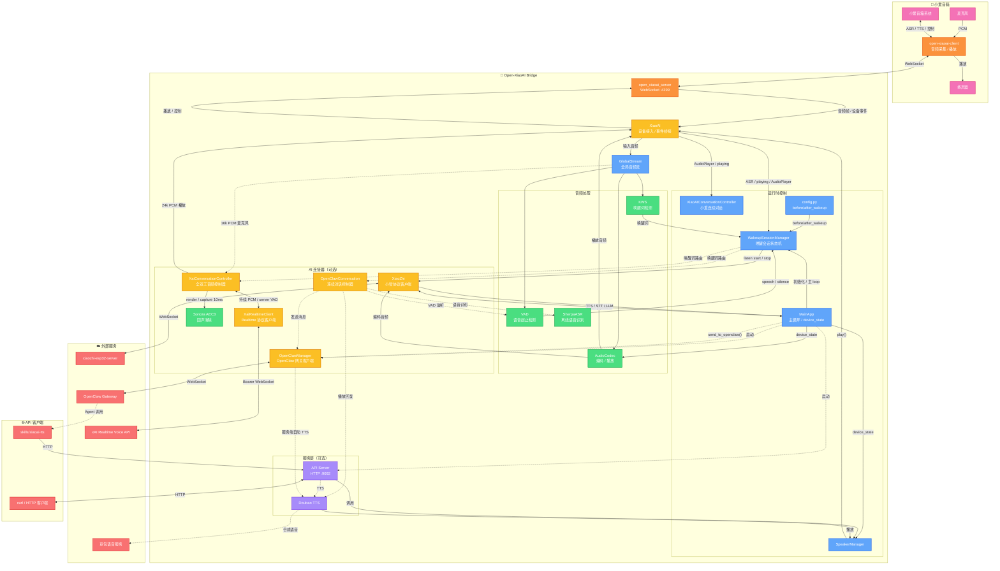

<div align="center">

# Open-XiaoAI Bridge

[](https://www.python.org/) [](https://www.rust-lang.org/) [](LICENSE) [](https://github.com/coderzc/open-xiaoai-bridge/stargazers) [](https://ghcr.io/coderzc/open-xiaoai-bridge)

[](https://github.com/coderzc/open-xiaoai-bridge/releases)

**小爱音箱与外部 AI 服务（小智 AI、OpenClaw、OpenAI 兼容服务、QwenPaw、xAI Grok Voice）的桥接器**

打破小爱音箱的封闭生态，灵活接入多种 AI 服务，提供 HTTP API 实现远程控制。

[📺 演示 ①](https://www.bilibili.com/video/BV1DHcBz1Ex7) · [📺 演示 ②](https://www.bilibili.com/video/BV1UQQSBHEvg)

[📖 快速开始](#-快速开始) · [🎙️ Grok Voice](#️-xai-grok-realtime-voice) · [🔌 OpenAI 兼容服务](#-openai-兼容服务) · [🐾 QwenPaw 集成](#-qwenpaw-集成) · [🦞 OpenClaw 集成](#-openclaw-集成) · [🔧 API 文档](#-api-server) · [🐛 常见问题](#-常见问题)

> 本项目受 [Open-XiaoAI](https://github.com/idootop/open-xiaoai) 启发，并参考其 `examples/xiaozhi/` 示例演进而来，现已作为独立项目持续维护。

</div>

***

## ✨ 功能一览

| 功能                 | 说明                                                                             |
| ------------------ | ------------------------------------------------------------------------------ |
| 🔌 **OpenAI 兼容服务** | 接入 Hermes Agent API Server、OpenAI、Ollama、LM Studio 等 `/v1/chat/completions` 服务 |
| 🐾 **QwenPaw 集成**   | 接入 [QwenPaw](https://github.com/agentscope-ai/QwenPaw) HTTP Console 任务接口，支持指定 Agent 和会话 |
| 🎙️ **Grok Voice 全双工** | 直连 xAI Realtime Voice，支持 Sonora AEC3 回声消除和语音插话打断 |
| 🦞 **OpenClaw 集成** | 接入 [OpenClaw](https://github.com/openclaw/openclaw)，支持连续对话，可选豆包 TTS 或小爱原生 TTS  |
| 🤖 **小智 AI 集成**    | 接入 [xiaozhi-esp32-server](https://github.com/xinnan-tech/xiaozhi-esp32-server) 实时音频流 |
| 🎙️ **自定义唤醒词**     | 支持中英文，不同唤醒词可路由到不同 AI 服务或不同 OpenClaw Agent                                      |
| 🧠 **多 Agent 路由**  | 一台音箱，多个唤醒词，每个唤醒词对应不同的 OpenClaw Agent Session，动态切换零开销                           |
| 💬 **连续对话**        | 多轮对话无需反复唤醒，喊"小爱同学"可随时打断                                                        |
| ⚡ **VAD + KWS**    | 语音活动检测前置，减少无效识别，更省电                                                            |
| 🌐 **HTTP API**    | 远程播放文字/音频、控制音箱                                                                 |
| 🧩 **模块化**         | 各功能独立开关，按需启用                                                                   |

***

## 🚀 快速开始

> **⚠️ 本项目仅包含服务端**，需要先在小爱音箱上安装 Client 端。

### 📦 前置步骤

1. **🔧 刷机** — 更新小爱音箱固件，开启 SSH
   - [刷机教程](https://github.com/idootop/open-xiaoai/blob/main/docs/flash.md)
2. **🛠️ 音箱补丁程序安装 Client** — 在音箱上运行 Rust Client 端
   - [补丁程序安装教程](https://github.com/coderzc/open-xiaoai/blob/main/packages/client-rust/README.md)

### 📥 模型文件

如果你启用小智 AI，或 OpenClaw / OpenAI 兼容服务 / QwenPaw 连续对话使用 `local_asr`，需要下载 `VAD + KWS + ASR` 模型文件。

如果 OpenClaw / OpenAI 兼容服务 / QwenPaw 连续对话使用 `xiaoai_asr`，或只启用 xAI Realtime Voice，只需要 `VAD + KWS`，不需要本地 ASR 模型。

1. 从 [releases](https://github.com/coderzc/open-xiaoai-bridge/releases/tag/vad-kws-asr-models) 下载模型压缩包
2. 解压模型文件（路径见下方具体部署方式）

### 🐳 Docker Compose（推荐）

模型文件解压到 `./models` 目录，然后下载配置并启动：

```bash
# 下载配置文件
curl -O https://raw.githubusercontent.com/coderzc/open-xiaoai-bridge/main/config.py
curl -O https://raw.githubusercontent.com/coderzc/open-xiaoai-bridge/main/docker-compose.yml

# 按需修改 config.py 和 docker-compose.yml，然后启动
docker compose up -d
```

> **💡 国内镜像加速**：如果拉取镜像太慢，可将 `docker-compose.yml` 中的镜像改为：
> ```yaml
> image: ghcr.nju.edu.cn/coderzc/open-xiaoai-bridge:latest
> ```

> **💡 容器访问宿主机服务**：如果需要让容器访问宿主机上的 OpenClaw / QwenPaw，请查看 [Docker 常见问题](#-docker)。

`docker-compose.yml` 已包含模型目录挂载：

```yaml
volumes:
  - ./models:/app/core/models
```

### 💻 本地编译

模型文件解压到 `core/models/` 目录，然后克隆仓库并启动：

```bash
git clone https://github.com/coderzc/open-xiaoai-bridge.git
cd open-xiaoai-bridge

# 依赖: uv, Rust
# Linux 还需要: pkg-config, patchelf

# 启动（按需设置环境变量）
API_SERVER_ENABLE=1 XIAOZHI_ENABLE=1 OPENCLAW_ENABLE=1 OPENAI_ENABLE=1 QWENPAW_ENABLE=1 XAI_ENABLE=1 ./scripts/start.sh

# 启用 Client 鉴权（需与音箱端 token 一致）
OPEN_XIAOAI_TOKEN=your-secret-token API_SERVER_ENABLE=1 ./scripts/start.sh
```

### ⚙️ 环境变量

| 变量                   | 说明            | 默认值           |
| -------------------- | ------------- | ------------- |
| `XIAOZHI_ENABLE`     | 启用小智 AI     | 禁用            |
| `OPENCLAW_ENABLE`    | 启用 OpenClaw | 禁用            |
| `OPENAI_ENABLE` | 启用 OpenAI 兼容服务 | 禁用        |
| `QWENPAW_ENABLE` | 启用 QwenPaw | 禁用        |
| `XAI_ENABLE` | 启用 xAI Grok Realtime Voice | 禁用 |
| `XAI_API_KEY` | xAI API Key，优先于 `config.py` | 空 |
| `API_SERVER_ENABLE`  | 启用 HTTP API | 禁用            |
| `AUDIO_INPUT_ENABLE` | 启用音频输入（关闭后小智/KWS/local\_asr不可用） | 启用            |
| `API_SERVER_HOST`    | API 监听地址    | `127.0.0.1`   |
| `API_SERVER_PORT`    | API 监听端口    | `9092`        |
| `OPEN_XIAOAI_TOKEN`  | Client 鉴权 token，设置后仅持有相同 token 的 Client 才能连接 | 不鉴权 |
| `CONFIG_PATH`        | 自定义配置文件路径   | `./config.py` |
| `LOGLEVEL`           | 日志级别        | `INFO`        |

***

## 🏗️ 系统架构



### 工作流程

**🎯 小智唤醒与对话**

```
麦克风 → client → server → XiaoAI → GlobalStream → KWS/小爱 ASR
→ WakeupSessionManager → before_wakeup() → VAD speech/silence
→ XiaoZhi start/stop listening → xiaozhi-esp32-server
```

**🔄 小爱连续对话**

```
小爱 ASR / AudioPlayer 事件 → XiaoAIConversationController
→ 决定继续唤醒或退出
```

**🦞 OpenClaw 单次对话**

```
小爱指令 "让龙虾 xxx" → before_wakeup() → send_to_openclaw()
→ OpenClawManager → Gateway → Agent
→ 自动 TTS 播报 或 Agent 主动调用 xiaoai-tts skill
```

**🦞 OpenClaw 连续对话**

```
唤醒词 "你好龙虾" → WakeupSessionManager → OpenClawConversationController
→ local_asr: VAD 检测语音 → SherpaASR 离线识别 → OpenClaw → TTS 播放
→ xiaoai_asr: 静默唤醒小爱 → 接管小爱原生 ASR → OpenClaw → TTS 播放
→ 说"退出"/"再见"退出
```

**🌐 远程控制**

```
curl POST /api/play/text → API Server → SpeakerManager → 小爱音箱
```

***

## 🔌 API Server

设置 `API_SERVER_ENABLE=1` 启用，默认端口 **9092**。

### 📡 端点列表

| 方法     | 路径                       | 说明           |
| ------ | ------------------------ | ------------ |
| `POST` | `/api/play/text`         | 播放文字（TTS）    |
| `POST` | `/api/play/url`          | 播放音频链接       |
| `POST` | `/api/play/file`         | 上传并播放音频文件    |
| `POST` | `/api/tts/doubao`        | 豆包 TTS 合成并播放 |
| `GET`  | `/api/tts/doubao_voices` | 获取可用音色列表     |
| `POST` | `/api/wakeup`            | 唤醒小爱音箱       |
| `POST` | `/api/interrupt`         | 打断当前播放       |
| `GET`  | `/api/status`            | 获取播放状态       |
| `GET`  | `/api/health`            | 健康检查         |

### 💡 使用示例

```bash
# 播放文字
curl -X POST http://localhost:9092/api/play/text \
  -H "Content-Type: application/json" \
  -d '{"text": "你好，我是小爱同学"}'

# 播放音频链接
curl -X POST http://localhost:9092/api/play/url \
  -H "Content-Type: application/json" \
  -d '{"url": "https://example.com/audio.mp3"}'

# 上传音频文件
curl -X POST http://localhost:9092/api/play/file \
  -F "file=@/path/to/audio.mp3"

# 豆包 TTS（可指定音色）
curl -X POST http://localhost:9092/api/tts/doubao \
  -H "Content-Type: application/json" \
  -d '{"text": "你好", "speaker_id": "zh_female_cancan_mars_bigtts"}'

# 打断播放
curl -X POST http://localhost:9092/api/interrupt
```

***

## 🎙️ xAI Grok Realtime Voice

xAI 模式与 OpenClaw / OpenAI / QwenPaw 的“本地 ASR → 文本 Agent → TTS”半双工链路不同。它会保持一条 Realtime WebSocket，持续上传 16 kHz PCM，并直接播放服务端返回的语音。

```bash
XAI_ENABLE=1 XAI_API_KEY=xai-xxx uv run main.py
```

在 `config.py` 中配置：

```python
"xai": {
    "api_url": "wss://api.x.ai/v1/realtime?model=grok-voice-latest",
    "api_key": "",  # 推荐使用 XAI_API_KEY
    "voice": "ara",
    "instructions": "你是一个有帮助的语音助手，请用简洁口语中文回答。",
    "sample_rate": 16000,
    "exit_keywords": ["退出", "停止", "再见"],
    "idle_timeout": 20,
    "aec": True,
    "aec_delay_ms": 150,
    "greeting": True,
    "session": {
        "reasoning": {"effort": "none"},
        "turn_detection": {
            "threshold": 0.85,
            "silence_duration_ms": 700,
            "prefix_padding_ms": 333,
        },
        "audio": {
            "input": {"transcription": {"language_hint": "zh"}},
            "output": {"speed": 1.0},
        },
        "replace": {},
    },
}
```

`before_wakeup` 返回 `"xai"` 即进入 Grok Voice。默认示例使用“你好 grok”或“召唤 grok”。

- `aec=True`：使用 host 侧 Sonora AEC3，播放期间继续上传麦克风，可语音插话。
- `aec=False`：AI 播放期间暂停上传并在结束后等待 250 ms 回声尾音，作为稳定的半双工降级模式。
- `aec_delay_ms`：音箱播放到麦克风采集之间的延迟提示，范围 `0..500`；不同网络和设备可从默认 `150` 开始调整。
- WebSocket 断线会结束当前会话并恢复 KWS，不会透明重连丢失上下文；下次唤醒建立新会话。
- 输入、上行和下行音频均限制为最多 300 ms backlog，网络阻塞时丢弃最旧音频，避免补播陈旧语音。
- `session` 是高级 `session.update` 参数块；`reasoning`、VAD 阈值、转写提示、语速和发音替换等可直接配置。16 kHz PCM、JSON transport、`server_vad` 和 `grok-transcribe` 由设备链路强制保证。
- `session.tools` 暂不接受，避免出现模型发起 function call 但本地没有执行器的死链路；后续 Custom Function Tools 将以独立 registry/executor 接入。
- `session.resumption.enabled=true` 时客户端会记录服务端 `conversation_id`；`XaiConversationState` 已负责续接 URL 和 30 分钟过期判断，但默认 controller 仍采用断线结束策略。后续重连只需把该 state 提升到会话管理层持久化。
- Session Resumption 只解决断线后重放历史，不等于上下文压缩。长会话摘要/裁剪应作为独立 `ConversationMemoryPolicy`，不要放进 WebSocket 协议层。

完整的 xAI Speech-to-Speech 参数与事件参考见 [docs/xai-speech-to-speech.md](docs/xai-speech-to-speech.md)。

***

## 🔌 OpenAI 兼容服务

用于接入 Hermes Agent API Server、OpenAI、Ollama、LM Studio 等兼容 OpenAI Chat Completions 的服务。它是独立后端，不依赖 OpenClaw 协议。

设置 `OPENAI_ENABLE=1` 启用。

`config.py` 示例：

```python
"openai": {
    "base_url": "http://127.0.0.1:8000/v1",
    "api_key": "",
    "model": "gpt-4o-mini",
    "input_mode": "local_asr",  # 或 "xiaoai_asr"
    "session_key": "default",
    "system_prompt": "",
    "temperature": 0.7,
    "max_tokens": 512,
    "history_max_messages": 20,
    "tts_speaker": "xiaoai",
}
```

触发连续对话时，在 `before_wakeup` 中返回 `"openai"`：

```python
async def before_wakeup(speaker, text, source, app):
    if source == "kws" and "小黑" in text:
        await speaker.play(text="小黑来了")
        return "openai"

    if source == "xiaoai" and text == "召唤小黑":
        await speaker.abort_xiaoai()
        return "openai"
```

单次发送并播报：

```python
if "让小黑" in text:
    await speaker.abort_xiaoai()
    await app.send_to_openai_and_play_reply(text.replace("让小黑", ""))
    return None
```

`base_url` 可以直接填到 `/v1`，框架会自动调用 `/chat/completions`；如果你的服务已经给出完整 `/v1/chat/completions` 地址，也可以直接填写完整地址。连续对话会按 `session_key` 保存最近 `history_max_messages` 条上下文；需要隔离多个助手时，可在唤醒前调用 `app.set_openai_session_key("assistant-name")`。

## 🐾 QwenPaw 集成

用于接入阿里的 [QwenPaw](https://github.com/agentscope-ai/QwenPaw)。桥接器会调用 QwenPaw 的 HTTP Console 后台任务接口，将小爱音箱识别到的文本发送给指定 Agent，并把回复通过小爱或豆包 TTS 播放出来。

推荐使用 Docker Compose 运行桥接器。先启动 QwenPaw（可在宿主机或同一 Docker 网络中运行），然后在 `docker-compose.yml` 中启用：

```yaml
services:
  open-xiaoai-bridge:
    environment:
      - QWENPAW_ENABLE=1
```

修改完成后启动桥接器：

```bash
docker compose up -d
```

如果 QwenPaw 运行在宿主机，容器里的 `127.0.0.1` 指向容器自身，需将 `base_url` 改为宿主机可访问地址，例如宿主机局域网 IP：

```python
"qwenpaw": {
    "base_url": "http://192.168.1.10:8088",
    "agent_id": "default",
    "session_key": "open-xiaoai-bridge",
}
```

也可以按 [Docker 常见问题](#-docker) 使用 `network_mode: host`，此时可继续使用 `http://127.0.0.1:8088`。

`config.py` 示例：

```python
"qwenpaw": {
    "base_url": "http://127.0.0.1:8088",
    "agent_id": "default",
    "user_id": "open-xiaoai-bridge",
    "input_mode": "local_asr",  # 或 "xiaoai_asr"
    "session_key": "open-xiaoai-bridge",
    "send_path": "/api/console/chat/task",
    "task_status_path": "/api/console/chat/task/{task_id}",
    "auth_token": "",
    "tts_speaker": "xiaoai",
}
```

触发连续对话时，在 `before_wakeup` 中返回 `"qwenpaw"`：

```python
async def before_wakeup(speaker, text, source, app):
    if source == "kws" and "小爪" in text:
        await speaker.play(text="小爪来了")
        return "qwenpaw"

    if source == "xiaoai" and text == "召唤小爪":
        await speaker.abort_xiaoai()
        return "qwenpaw"
```

单次发送并播报：

```python
if "让小爪" in text:
    await speaker.abort_xiaoai()
    await app.send_to_qwenpaw_and_play_reply(text.replace("让小爪", ""))
    return None
```

`agent_id` 会通过 `X-Agent-Id` 请求头发送给 QwenPaw；`session_key` 对应 QwenPaw 请求里的 `session_id`，需要隔离多个对话时可在唤醒前调用 `app.set_qwenpaw_session_key("speaker-session")`。

`auth_token` 是可选项，非空时程序默认会附带 `Authorization` 认证头，不需要额外配置 `auth_header` / `auth_scheme`。如果你的部署要求自定义认证头，可按需增加：

```python
"qwenpaw": {
    "auth_header": "X-API-Key",
    "auth_scheme": "",
    "auth_token": "your-token",
}
```

`auth_scheme` 设为空字符串时，请求头会直接发送 `auth_token` 原始值。

## 🦞 OpenClaw 集成

通过 [OpenClaw](https://github.com/openclaw/openclaw) 将小爱音箱变成你的 AI Agent 终端。

设置 `OPENCLAW_ENABLE=1` 启用（兼容旧值 `OPENCLAW_ENABLED`）

### 🎯 交互方式

#### 🎙️ 方式一：连续对话

用自定义唤醒词触发后进入多轮对话循环，支持两种输入模式：

```
local_asr: 本地 VAD + SherpaASR
xiaoai_asr: 接管小爱原生 ASR
```

`config.py` 示例：

```python
"openclaw": {
    "input_mode": "xiaoai_asr",  # 或 "local_asr"
}
```

- 说"退出"或"再见"退出对话
- 小爱唤醒时自动打断 TTS 并退出
- 退出关键词可自定义
- `xiaoai_asr` 模式下不需要本地 ASR 模型

触发方式见下方[自定义唤醒词](#-自定义唤醒词)，`before_wakeup` 返回 `"openclaw"` 即进入连续对话。

#### 💬 方式二：单次对话（发送并播报）

通过小爱语音指令发送一条消息给 Agent，收到回复后自动 TTS 播报：

```python
# config.py 中的 before_wakeup
if "让龙虾" in text:
    await speaker.abort_xiaoai()
    await app.send_to_openclaw_and_play_reply(text.replace("让龙虾", ""))
    return None  # 框架不做额外处理
```

用户说"让龙虾查一下明天天气" → 打断小爱 → 发给 Agent → TTS 播报回复。

#### 📡 方式三：单次对话（Agent 自主播报）

只发送消息，不自动播报，由 Agent 调用 `xiaoai-tts` skill 自主播报：

```python
if "告诉龙虾" in text:
    await speaker.abort_xiaoai()
    await app.send_to_openclaw(text.replace("告诉龙虾", ""))
    return None
```

`send_to_openclaw()` 会自动追加 `rule_prompt_for_skill`（配置在 `config.py` 中），告诉 Agent 需要调用 skill 播报。适合 Agent 需要做复杂处理后再决定是否/如何播报的场景。

### 🎙️ 自定义唤醒词

唤醒词在 `config.py` 的 `wakeup.keywords` 中定义，支持中英文混合：

```python
"wakeup": {
    "keywords": [
        "你好小智",        # 中文
        "小智小智",
        "hi openclaw",    # 英文（全小写）
        "你好龙虾",
        "龙虾你好",
    ],
},
```

不同唤醒词可以路由到不同 AI 服务，在 `before_wakeup` 中根据文本内容判断：

```python
async def before_wakeup(speaker, text, source, app):
    if source == "kws":          # 唤醒词触发
        if "龙虾" in text:
            await speaker.play(text="龙虾来了")
            return "openclaw"    # → OpenClaw 连续对话
        if "小智" in text:
            await speaker.play(text="小智来了")
            return "xiaozhi"     # → 小智 AI
        return None              # → 不处理

    if source == "xiaoai":       # 小爱语音指令
        if text == "召唤龙虾":
            await speaker.abort_xiaoai()
            return "openclaw"
        if text == "召唤小智":
            await speaker.abort_xiaoai()
            return "xiaozhi"
    # 返回 None → 交给小爱原生处理
```

**返回值含义：** `"openclaw"` → OpenClaw 连续对话，`"openai"` → OpenAI 兼容服务连续对话，`"qwenpaw"` → QwenPaw 连续对话，`"xai"` → xAI Grok Voice 全双工对话，`"xiaozhi"` → 小智 AI，`None` → 不处理（用户可自行调用 `app.send_to_openclaw()` / `app.send_to_openai()` / `app.send_to_qwenpaw()` 等方法）

### 🧠 多 Agent 路由 — 一个唤醒词，一个专属 Agent

`set_openclaw_session_key()` 让你在发送消息前动态切换目标 Agent Session，**无需重连，无性能开销**。结合自定义唤醒词，可以实现：

> **一台音箱，N 个专属 AI 助手，按名字呼唤谁，谁就来响应。**

```python
# config.py

AGENT_SESSIONS = {
    "龙虾": "agent:assistant:open-xiaoai-bridge",
    "小美": "agent:xiaomei:open-xiaoai-bridge",
    "管家": "agent:butler:open-xiaoai-bridge",
}

async def before_wakeup(speaker, text, source, app):
    if source == "kws":
        for keyword, session_key in AGENT_SESSIONS.items():
            if keyword in text:
                app.set_openclaw_session_key(session_key)  # 切换到对应 Agent
                await speaker.play(text=f"{keyword}来了")
                return "openclaw"                          # 进入连续对话

    if source == "xiaoai":
        for keyword, session_key in AGENT_SESSIONS.items():
            if f"召唤{keyword}" in text:
                app.set_openclaw_session_key(session_key)
                await speaker.abort_xiaoai()
                return "openclaw"
```

配合唤醒词配置：

```python
"wakeup": {
    "keywords": [
        "你好龙虾", "你好小美", "你好管家",
    ],
},
```

此后你说"**你好龙虾**"，进入的是龙虾 Agent 的上下文；说"**你好小美**"，进入的是小美 Agent 的上下文 —— 同一台音箱，完全隔离的多个 AI 人格。

退出时同样可以区分是哪个 Agent 结束了对话。`after_wakeup` 在 OpenClaw 退出时会收到 `session_key` 参数，取第二段即为 `agentId`：

```python
async def after_wakeup(speaker, source=None, session_key=None):
    if source == "openclaw":
        # session_key 格式：agent:<agentId>:<rest>，第二段即 agentId
        agent_id = session_key.split(":")[1] if session_key else None
        if agent_id == "assistant":
            await speaker.play(text="龙虾，再见")
        elif agent_id == "xiaomei":
            await speaker.play(text="小美，再见")
        elif agent_id == "butler":
            await speaker.play(text="管家，再见")
        else:
            await speaker.play(text="再见")
    if source == "xiaozhi":
        await speaker.play(text="小智，再见")
```

### 📝 rule_prompt — 约束 Agent 输出格式

有两个 prompt 配置，分别用于不同的播报场景：

| 配置 | 使用场景 | 自动追加位置 |
|------|---------|-------------|
| `rule_prompt` | 自动播放、连续对话 | `send_to_openclaw_and_play_reply()`、连续对话循环 |
| `rule_prompt_for_skill` | Agent 自主播报（方式三） | `send_to_openclaw()` |

**为什么需要两个 prompt？**

- **`rule_prompt`**：服务端会自动 TTS 播放，只需告诉 Agent 输出纯文字、控制字数
- **`rule_prompt_for_skill`**：服务端不会自动播放，需要告诉 Agent **主动调用 `xiaoai-tts` skill** 来播报

示例配置：

```python
"openclaw": {
    # 自动播放/连续对话用：约束输出格式
    "rule_prompt": "注意：将结果处理成纯文字版，不要返回任何 markdown 格式，也不要包含任何代码块，并将字数控制在300字以内",
    # Agent 自主播报用：告诉 Agent 需要调用 skill
    "rule_prompt_for_skill": "注意：这条消息是主人通过小爱音箱发送的，他看不到你回复的文字，调用 `xiaoai-tts` skill 播报出来。字数控制在300字以内",
}
```

不需要可以留空或不设置。

### 🎵 OpenClaw TTS 音色

`openclaw.tts_speaker` 支持两种值：

| 值          | 效果       | 说明                                                    |
| ---------- | -------- | ----------------------------------------------------- |
| `"xiaoai"` | 小爱原生 TTS | 零配置即可使用，音色由设备决定                                       |
| 豆包音色 ID    | 豆包语音合成   | 需配置 `tts.doubao` 的 `app_id` 和 `access_key`，详见 [豆包 TTS 章节](#-豆包-tts) |

如果希望不同 Agent 使用不同音色，可以配置 `openclaw.agent_tts_speakers`。它会根据当前 `session_key` 中的 `agentId` 选择对应音色；未命中时回退到 `openclaw.tts_speaker`。

```python
"openclaw": {
    # 默认音色：未命中 agent_tts_speakers 时使用
    "tts_speaker": "xiaoai",
    # 按 agentId 覆盖音色
    "agent_tts_speakers": {
        "main": "xiaoai",
        "assistant": "zh_female_vv_uranus_bigtts",
        "xiaomei": "zh_female_shuangkuaisisi_moon_bigtts",
        "butler": "zh_male_raphael_bigtts",
    },
}
```

例如当前 `session_key` 是 `agent:assistant:open-xiaoai-bridge`，则会使用 `assistant` 对应的音色。

### 🧩 Skills

`skills/xiaoai-tts/` — Agent 通过 HTTP API 控制小爱播放语音，支持小爱内置 TTS 和豆包 TTS。

📖 详见 [SKILL.md](skills/xiaoai-tts/SKILL.md)

***

## 🤖 小智 AI 集成

接入 [xiaozhi-esp32-server](https://github.com/xinnan-tech/xiaozhi-esp32-server)，使用小智 AI 的对话能力。

设置 `XIAOZHI_ENABLE=1` 启用

### 配置

```python
APP_CONFIG = {
    "xiaozhi": {
        "OTA_URL": "http://127.0.0.1:8003/xiaozhi/ota/",
        "WEBSOCKET_URL": "ws://127.0.0.1:8000/xiaozhi/v1/",
        "WEBSOCKET_ACCESS_TOKEN": "",  # 可选
        # "DEVICE_ID": "",  # 可选，默认自动生成
    },
}
```

### 使用

唤醒词触发后，`before_wakeup` 返回 `"xiaozhi"` 即进入小智对话流程。

详见[自定义唤醒词](#-自定义唤醒词)章节。

***

## ❓ 常见问题

### 🐳 Docker

1. **在容器里如何通过 `127.0.0.1` 直连宿主机上的 OpenClaw / QwenPaw？**

    默认 `docker-compose.yml` 已经去掉了 `network_mode: host`，不需要再额外修改这一行。

    需要注意：桥接模式下，容器里的 `127.0.0.1` / `localhost` 指向的是**容器自己**，不是宿主机。

    如果你希望通过 `127.0.0.1` 直连宿主机上的 OpenClaw / QwenPaw，使用 **方式 1**:

    **方式 1：增加 `network_mode: host`**

    在 `docker-compose.yml` 里添加：

    ```yaml
    services:
        open-xiaoai-bridge:
            network_mode: host
    ```

    **方式 2：通过网络 IP 连接（无需 host 模式）**

    如果不使用 `network_mode: host`，可以让 OpenClaw / QwenPaw 监听 LAN，然后在容器里通过宿主机的局域网 IP 连接：

    可以直接一起改成下面这样：

    ```text
    # OpenClaw
    {
      "gateway": {
        "port": 18789,
        "mode": "lan",
        "controlUi": {
          "allowedOrigins": [
            "http://localhost:18789",
            "http://127.0.0.1:18789",
            "http://192.168.5.123:18789"
          ]
        }
      }
    }

    # config.py
        "openclaw": {
            "url": "ws://192.168.5.123:18789",
            "token": "xxxxx"
            ...
        }
    ```

    PS: 最好固定 IP 地址。

### 🎙️ 唤醒词与连续对话

1. **模型文件在哪下载？**

    小智 AI 和 `local_asr` 模式需要 `VAD + KWS + ASR` 模型文件。  
    `xiaoai_asr` 和 xAI Realtime Voice 模式只需要 `VAD + KWS`。

    详见[快速开始 - Docker Compose](#-docker-compose推荐) 或 [本地编译](#-本地编译) 章节。

2. **如何切换 ASR 语音识别模型？**

    仅 `openclaw.input_mode = "local_asr"` 时，ASR 配置才会生效。在 `config.py` 中配置：

    ```python
    APP_CONFIG = {
        "asr": {
            "model": "sense_voice",  # "sense_voice"（默认）/ "paraformer" / "fire_red_asr" / "doubao"
            "int8": True,            # 本地模型优先加载 INT8 量化模型
            # "model_dir": "sherpa-onnx-fire-red-asr-xxx",  # 可选：显式指定本地模型目录
        },
    }
    ```

    | 模型 | 说明 | 特点 |
    |------|------|------|
    | `sense_voice` | [SenseVoice-Small](https://github.com/FunAudioLLM/SenseVoice) | 多任务语音理解模型，支持中/英/日/韩/粤五语种自动识别，附带语言检测、ITN 和情感识别，推理极快 |
    | `paraformer` | [Paraformer-Trilingual](https://github.com/modelscope/FunASR) | 专注语音转写的工业级非自回归模型，支持中文/英文/粤语，中文识别精度高 |
    | `fire_red_asr` | [FireRedASR](https://github.com/FireRedTeam/FireRedASR) | FireRedASR 是一系列开源的工业级自动语音识别 (ASR) 模型，支持普通话、汉语方言和英语，在公开的普通话 ASR 基准测试中达到了新的最先进水平 (SOTA)，同时还提供了出色的歌词识别能力。 |
    | `doubao` | [火山引擎豆包语音识别](https://www.volcengine.com/docs/6561/1354868?lang=zh) | 云端录音文件识别，支持标准版和极速版，需要配置火山引擎 App Key / Access Key |

    使用本地模型时，将对应模型目录放到 `core/models/`（Docker 部署放 `./models/`）下即可，不配置默认使用 `sense_voice`。

    使用豆包 ASR 时，将 `model` 改为 `"doubao"`，并填写 `asr.doubao`：

    ```python
    APP_CONFIG = {
        "asr": {
            "model": "doubao",
            "doubao": {
                # "standard": 录音文件识别标准版，调用 /submit + /query
                # "flash": 录音文件极速版，调用 /recognize/flash
                "mode": "standard",
                "app_key": "你的 App Key",
                "access_key": "你的 Access Key",
                # 火山 X-Api-Resource-Id：
                # standard 可选：
                #   "volc.bigasr.auc"  - 豆包录音文件识别模型 1.0
                #   "volc.seedasr.auc" - 豆包录音文件识别模型 2.0
                # flash 可选：
                #   "volc.bigasr.auc_turbo" - 录音文件极速版
                "resource_id": "volc.seedasr.auc",
                "language": "",
                "submit_timeout": 10,
                "query_timeout": 10,
                "poll_interval": 0.5,
                "max_wait_seconds": 20,
            },
        },
    }
    ```

    `standard` 模式会把本地 PCM 封装为 wav 后以 base64 提交到标准版接口；如果你的火山账号不支持该请求形式，可切换为 `flash` 并将 `resource_id` 改为 `"volc.bigasr.auc_turbo"`。

3. **如何打断 AI 的回答？**

    直接喊"小爱同学"即可打断所有会话。xAI 开启 AEC 时也可直接插话，由 server VAD 停止当前 Grok Voice 播放。

4. **话没说完 AI 就开始回答？**

    调大 `min_silence_duration`：

    ```python
    APP_CONFIG = {
        "vad": {
            "min_silence_duration": 1000,  # 毫秒
        },
    }
    ```

5. **唤醒词没反应？**

    - 调低 `vad.threshold`（越小越灵敏，如 `0.05`）
    - 启动后需等约 30s 加载模型
    - 英文唤醒词用空格分开（如 `"open ai"`）
    - 换更易识别的唤醒词

6. **麦克风音量太小，唤醒词 / ASR 识别不准？**

    在 `config.py` 中调大输入增益：

    ```python
    APP_CONFIG = {
        "audio_input": {
            "gain": 2.0  # 增益倍数，1.0 = 不处理；建议从 2.0 开始逐步调整
        },
    }
    ```

    > 增益过高会引入失真，反而影响识别，适度调整即可。

7. **如何播放服务端本地音频文件？**

    可以直接调用：

    ```python
    await speaker.play(server_file="/path/to/hello.wav")
    ```

    这里的路径是**运行 open-xiaoai-bridge 的这台机器**上的本地文件路径，不是音箱里的路径。
    如果是 Docker 部署，请记得把对应目录挂载进容器。

### 🦞 OpenClaw

1. **首次连接出现 pairing required？**

    正常流程。保持服务在线，到 OpenClaw UI 批准设备：**Nodes → Devices → Approve**。

2. **容器重建后需要重新配对？**

    Docker 部署时挂载 `identity_path` 目录为持久化卷，否则设备身份丢失需重新配对：

    ```yaml
    # docker-compose.yml
    volumes:
      - ./openclaw:/app/openclaw
    ```

3. **session\_key 是什么？**

    告诉 Gateway 把消息路由到哪个 Agent Session，格式为冒号分隔的层级路径：

    ```
    agent:<agentId>:<rest>
    ```

    | 字段          | 说明                                 | 示例                          |
    | ----------- | ---------------------------------- | --------------------------- |
    | `agent`     | 固定前缀                               | `agent`                     |
    | `<agentId>` | OpenClaw 中配置的 Agent ID（默认为 `main`） | `main`、`assistant`          |
    | `<rest>`    | 会话标识，可自由命名，用于区分不同来源/场景             | `home`、`open-xiaoai-bridge` |

    常见格式举例：

    ```
    agent:main:open-xiaoai-bridge          # 默认值（本项目）
    agent:main:main                        # OpenClaw 原生默认主会话
    agent:assistant:open-xiaoai-bridge     # 指定其他 Agent
    agent:main:direct:alice                # 按用户隔离
    ```

4. **如何在运行时动态切换 session\_key？**

    每次唤醒触发 `before_wakeup` 之前，框架会自动将 `session_key` **重置为配置文件中的默认值**。因此：

    - 在 `before_wakeup` 中调用 `app.set_openclaw_session_key()` → 本次唤醒使用指定的 session
    - 不调用 → 自动使用配置文件中的 `openclaw.session_key`，不会沿用上一次的值

    这意味着你只需要在需要切换的路径里调用一次，不用担心"忘记重置"的问题。

    常见使用场景：

    **场景一：按唤醒词路由到不同 Agent**

    说"你好龙虾"唤醒龙虾 Agent，说"你好小美"唤醒小美 Agent：

    ```python
    AGENT_SESSIONS = {
        "龙虾": "agent:assistant:open-xiaoai-bridge",
        "小美": "agent:xiaomei:open-xiaoai-bridge",
        "管家": "agent:butler:open-xiaoai-bridge",
    }

    async def before_wakeup(speaker, text, source, app):
        if source == "kws":
            for keyword, session_key in AGENT_SESSIONS.items():
                if keyword in text:
                    app.set_openclaw_session_key(session_key)
                    await speaker.play(text=f"{keyword}来了")
                    return "openclaw"
    ```

    **场景二：每次唤醒生成独立 Session**

    每次对话互相隔离，适合以下情况：

    - "提问 → 回答"式交互，不需要 Agent 记住上下文
    - 长期使用同一 Session 导致 Agent 上下文堆积过长，影响响应质量和速度

    ```python
    import uuid

    def new_session_key():
        return f"agent:main:session-{uuid.uuid4().hex[:8]}"

    async def before_wakeup(speaker, text, source, app):
        if source == "kws" and "龙虾" in text:
            app.set_openclaw_session_key(new_session_key())
            await speaker.play(text="龙虾来了")
            return "openclaw"
    ```

5. **send\_to\_openclaw() 的返回值是什么？**

    - `send_to_openclaw(text)` → 成功返回 `run_id`（str），失败返回 `None`
    - `send_to_openclaw(text, wait_response=True)` → 成功返回回复文本，超时/失败返回 `None`
    - `send_to_openclaw_and_play_reply(text)` → 同上，但会自动 TTS 播放回复

### 🤖 小智 AI

1. **第一次运行提示验证码绑定设备？**

    打开小智 AI [管理后台](https://xiaozhi.me/)，根据提示创建 Agent 绑定设备。验证码会在终端打印或写入 `config.py`：

    ```python
    APP_CONFIG = {
        "xiaozhi": {
            "VERIFICATION_CODE": "首次登录时，验证码会在这里更新",
        },
    }
    ```

    绑定成功后可能需要重启应用。

2. **怎样使用自己部署的 xiaozhi-esp32-server？**

    修改 `config.py` 中的接口地址：

    ```python
    APP_CONFIG = {
        "xiaozhi": {
            "OTA_URL": "https://your-server/xiaozhi/ota/",
            "WEBSOCKET_URL": "wss://your-server/xiaozhi/v1/",
        },
    }
    ```

### 🎵 豆包 TTS

1. **如何配置豆包 TTS？**

    1. 开通[火山引擎语音合成服务](https://www.volcengine.com/docs/6561/1871062)，获取 App ID 和 Access Key（[接入文档](https://www.volcengine.com/docs/6561/1598757?lang=zh)）
    2. 填入配置：

    ```python
    "tts": {
        "doubao": {
            "app_id": "你的 App ID",
            "access_key": "你的 Access Key",
            "default_speaker": "zh_female_cancan_mars_bigtts",  # 默认音色，可选列表见下方
        }
    }
    ```

    音色列表：[火山引擎音色库](https://www.volcengine.com/docs/6561/1257544?lang=zh)

2. **如何使用声音复刻？**

   1. 在[火山引擎控制台](https://console.volcengine.com/speech/service/10036?AppID=)「声音复刻详情」中获取预分配的 Speaker ID（格式 `S_xxxxxxxx`）
   2. 准备一段 10-30 秒清晰人声音频（支持 wav/mp3/m4a 等，≤10MB）
   3. 运行克隆脚本：
   ```bash
   python3 scripts/clone_voice.py --speaker-id S_xxxxxxxx --audio sample.wav
   ```
   训练完成后会输出 demo 试听链接和可用的模型类型（ICL 1.0 / ICL 2.0）。
   4. **重要**：确保复刻音色与 `tts.doubao.app_id` 属于**同一个火山引擎项目**，否则无法使用。
3. **如何将指定文本转成特定音色的音频文件？**

   可以使用脚本 [scripts/generate\_tts.py](/Users/zc/projects/open-xiaoai-bridge/scripts/generate_tts.py)：
   ```bash
   python3 scripts/generate_tts.py \
     --speaker-id zh_male_lengkugege_emo_v2_mars_bigtts \
     --text "你好，今天心情很好" \
     --emotion happy \
     --output ./output/happy.wav
   ```
   其中 `--speaker-id` 必填，`--text` 和 `--text-file` 二选一，`--output` 用来指定输出文件名；`--emotion` 仅部分多情感音色支持。

4. **支持流式播放吗？怎么配置？**

   支持。推荐配置：
   ```python
   "tts": {
       "doubao": {
           "stream": True,           # 流式播放，首音延迟更低
           "audio_format": "pcm",    # 局域网推荐，首音更快
           # "audio_format": "auto", # 短文本 PCM，长文本 MP3
       }
   }
   ```
   - `pcm`：首音快，流式稳定，长文本总耗时可能更高
   - `mp3`：传输效率高，长文本更早结束
   - `auto`：折中方案，按文本长度自动选择

   冒烟测试（无需音箱，验证 TTS 是否正常）：
   ```bash
   python3 tests/test_tts_stream.py                                           # 测试流式 TTS 连通性
   python3 tests/test_tts_latency.py --formats mp3,pcm --rounds 3 --repeat 8  # 对比 mp3/pcm 延迟
   ```

## 致谢

感谢 [Open-XiaoAI](https://github.com/idootop/open-xiaoai) 及其 `examples/xiaozhi/` 示例提供的启发与参考。

***

## 🚨 免责声明

本项目为非官方技术研究项目，与小米及其关联公司不存在任何隶属、合作、授权、认可或背书关系。

使用者应自行确认其使用行为符合适用法律法规、平台规则、设备厂商政策及相关服务协议，并自行承担由下载、安装、配置、修改、传播或使用本项目所产生的全部风险与责任。

详细免责声明请见 [DISCLAIMER.md](./DISCLAIMER.md)。项目授权与分发条件以仓库中的 [LICENSE](./LICENSE) 文件为准。

***

## 📚 参考资源

| 资源              | 链接                                                                                                                                                                                                                                                       |
| --------------- | -------------------------------------------------------------------------------------------------------------------------------------------------------------------------------------------------------------------------------------------------------- |
| 🔧 刷机教程         | [刷机教程](https://github.com/idootop/open-xiaoai/blob/main/docs/flash.md)                                                                                                                                                                                   |
| 🛠️ Client 端安装  | [Client 端安装](https://github.com/idootop/open-xiaoai/blob/main/packages/client-rust/README.md)                                                                                                                                                            |
| 🎙️ 豆包 TTS 音色列表 | [火山引擎文档](https://www.volcengine.com/docs/6561/1257544)                                                                                                                                                                                                   |

***

<div align="center">

**Made with ❤️ by** **[coderzc](https://github.com/coderzc)**

如果这个项目对你有帮助，请给它一颗 ⭐️

</div>
